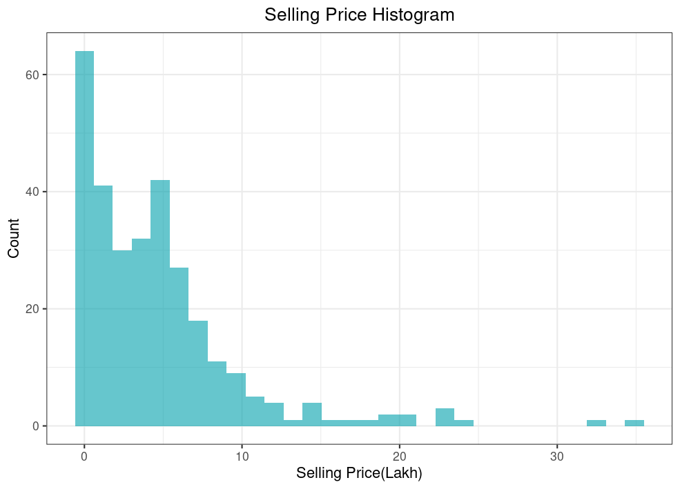
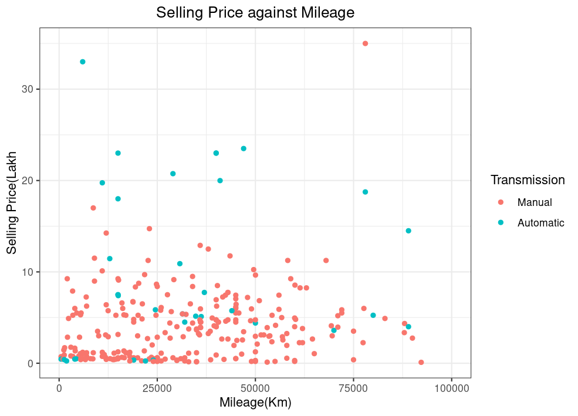
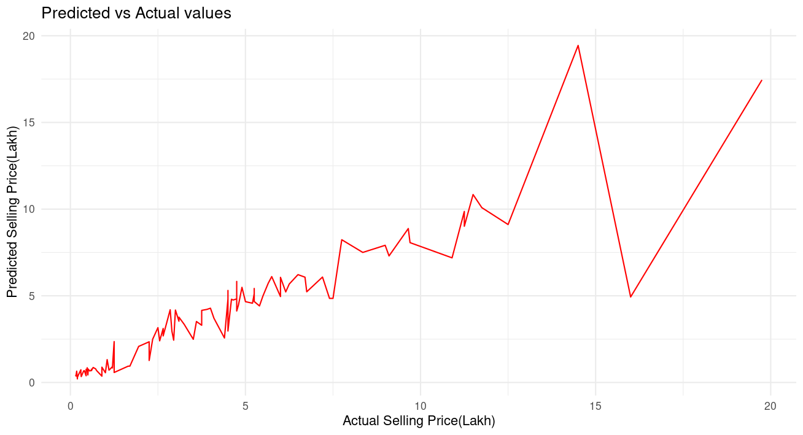

# Summary
The analysis was focused on determining what variables have a significant impact on used car pricing. The model used was a linear regression which had an r-squared of 0.91 which indicates that the model was a good fit. Highly significant variables included: Year of manufacture, seller type(individual or dealer), transmission(automatic or manual), fuel type(petrol or diesel) and the listed price.

# Introduction
The aim of this analysis was to determine the factors that had the most effect on used car prices and also predict selling price of used cars given new data.

# Findings

Majority of the cars’ selling price was below 10 lakh and the mean selling price was 4.7 lakh. There were however some observations that were above 30 lakh which indicated presence of outliers that could have an effect on the model fit.

The above plot shows relationship between selling price and fuel type. Diesel cars are generally more expensive than petrol cars. There are only 2 observations of CNG powered cars hence we cannot make accurate assessments on CNG fuel type.

Mileage(Kms_Driven) does not seem to have a significant impact on selling price according to the plot above. Transmission appears to have a small impact on selling price as automatic cars seem to be more pricey compared to their manual counterparts as also shown by the plot below.

## Model
| Variable | Estimate | p-value |
| -------- | -------- | ------- |
| Year     | 0.1143   | <2e-16 *** |
| Present_Price | 0.07936 | <2e-16 *** |
| Kms_Driven | -0.0000007351 | 0.334 |
| Fuel_TypeDiesel | 0.1449 | 0.074 . | 
| Fuel_TypeCNG | -0.1431 | 0.587 |
| Seller_TypeIndividual | -1.452 | <2e-16 *** |
| TransmissionAutomatic | -0.2228 | 0.017 * |
| Owner | 0.04447 | 0.642 |

This shows the various factors and how significant they are to selling price. The most significant variables are year of manufacture, present price(list price) and seller type with almost very small p values. Fuel type and Transmission were also significant with relatively low p values. Mileage and number of previous owners were not significant.

### Predictions

The model is accurate when predicting lower values of the selling price but gets more inaccurate as the selling price increases. The RMSE(Root Mean Squared Error) was 1.484 and the MAE(Mean Absolute Error) was 0.762 which shows the model was fairly accurate when predicting selling price.
